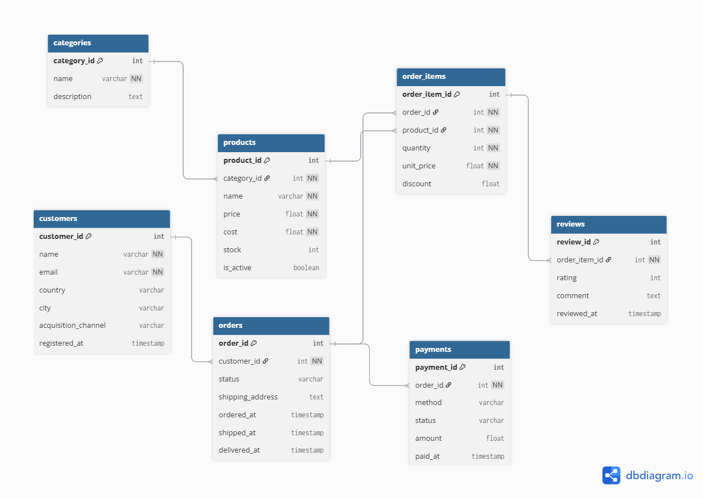

# Proyecto E-Commerce: Novarix Data
Proyecto Team Challenge - M004
## Descripción
Este proyecto consiste en el diseño y despliegue de una infraestructura de datos completa para un E-Commerce, desde el modelado relacional (3NF) hasta la implementación en Google BigQuery.

## Objetivos del Proyecto

El desarrollo de este ecosistema de datos busca alcanzar los siguientes puntos estratégicos:

*   **Modelado Robusto:** Diseñar e implementar una arquitectura de base de datos relacional bajo la tercera forma normal (3NF) para garantizar la escalabilidad.
*   **Automatización de Datos:** Desarrollar scripts de generación de datos sintéticos realistas para simular un entorno de producción de E-Commerce.
*   **Integración Cloud:** Desplegar y gestionar la infraestructura de datos de forma centralizada utilizando Google BigQuery.
*   **Integridad y QA:** Establecer un pipeline de validación sistemática para detectar anomalías, asegurar la calidad de la información y facilitar la toma de decisiones basada en datos fiables.

## Equipo
* **Scrum Master:** Marta
* **Data Architect:** Claudia
* **Data Engineer:** Isaac
* **QA & Documentation:** María

## Stack Tecnológico-Requisitos del sistema

*   **Base de Datos:** Google BigQuery.
*   **Lenguaje:** Python 3.x.
*   **Gestión de Entorno:** 
    *   Uso de **entorno virtual (`venv`)**.
    *   Gestión de credenciales mediante **variables de entorno (`.env`)** para garantizar la seguridad de las claves de Google Cloud.
*   **Librerías Principales:**
    *   `Pandas`: Manipulación y análisis de estructuras de datos.
    *   `Faker`: Generación de datos sintéticos realistas.
    *   `Google-cloud-bigquery`: Conexión y gestión de la infraestructura en la nube.
    *   `Python-dotenv`: Carga de configuraciones desde archivos de entorno.

Para ejecutar este proyecto, es necesario instalar las dependencias detalladas en `requirements.txt`:
> **Nota:** Para ello, instala las librerías ejecutando `pip install -r requirements.txt`.

## Estructura del Repositorio
El proyecto se desarrolla en 6 etapas secuenciales (dentro de la carpeta "notebooks", por orden):
* `notebooks/01_setup_bigquery.ipynb`: Configuración inicial y prueba de conexión entre el entorno local de Python y Google BigQuery, prepara el "puente" para poder trabajar con datos en la nube de Google Cloud.

* `notebooks/02_create_tables_1.ipynb`: Creación de la infraestructura de datos: configuración y creación del Dataset. Define la estructura relacional de las tablas del proyecto (Data Modeling) y utiliza la API de BigQuery para generar automáticamente el dataset y las 7 tablas maestras. El notebook asegura que la base de datos tenga la estructura correcta antes de empezar a subirle datos reales.

* `notebooks/03_generate_and_load_1.ipynb`: Tiene la función de Generación y Carga de Datos Sintéticos. en lugar de usar datos reales, utiliza la librería `Faker` para inventar miles de registros realistas y llenar las tablas creadas en el notebook 02.

* `notebooks/04_validate_data.ipynb`: Verifica que los datos sintéticos generados en el paso anterior se subieron correctamente y tienen sentido lógico. 

* `notebooks/05_reset_tables.ipynb`: Este notebook sirve para limpiar el área de trabajo sin borrar la estructura de la base de datos. Realiza una limpieza selectiva facilitando la re-ejecución de pruebas y el re-poblamiento del dataset sin necesidad de recrear los esquemas desde cero."

* `notebooks/06_queries_verification.ipynb`: El último paso. Actúa como control de calidad (QA).Este notebook recoge 5 consultas SQL avanzadas (queries) para asegurarse de que con el modelo cumple lo siguiente:
    1) Validación de limpieza: Deteccion de errores de integridad (duplicados o incoherencias)
    2) Integridad referencial: verificación de conexiones entre tablas mediante Joins complejos.
    3) Análisis de Negocio: Ranking de clientes VIP (los que más gastan en el negocio), volumen de facturación según el estado del pedido, etc.
En resumen, gracias a este notebook se demuestra que el sistema no solo guarda datos, sino que genera información útil para el negocio. Se transforman datos en información.

* `docs/`: Diagrama Entidad-Relación y justificación del cumplimiento de la Tercer Forma Normal (3NF).

## Modelo de Datos (ERD)

A continuación se detalla el diseño relacional (3NF) implementado para la infraestructura de Novarix:

### Decisiones de diseño (Data Modeler)

| Decisión | Justificación |
|---|---|
| unit_price en order_items | El precio al comprar puede cambiar; es un dato del evento, no del producto |
| product_name solo en products | En order_items dependería solo de product_id, violando 2NF |
| country directo en customers | Sin más atributos de país no hay dependencia transitiva |
| customer_name no está en orders | Evita la cadena transitiva order_id → customer_id → customer_name |
| reviews apunta a order_items | Se valora un producto específico comprado, no el pedido completo |
| PK surrogate en order_items | Evita ambigüedad con claves compuestas |

## Seguridad y Configuración

* Variables de entorno: Se utiliza un archivo `.env` para gestionar el `PROJECT_ID` y el `DATASET_ID`sin exponerlos en el código.

* Protección de Datos: El archivo `.gitignore` ha sido configurado específicamente para ignorar cualquier archivo `*.json`(credenciales de Google Cloud) y proteger la seguridad del proyecto. 